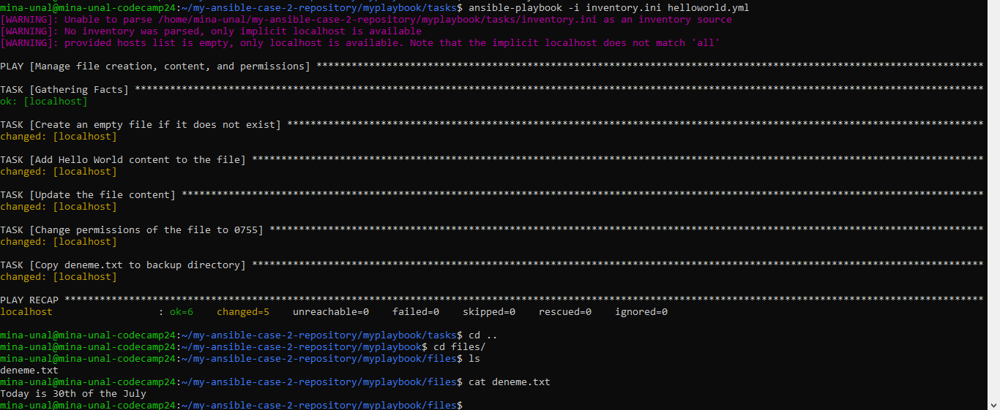

**TO-DO**  
1- Ansible, Linux'ta çalışan bir otomasyon aracıdır. Bu nedenle bir playbook oluşturup onu çalıştırmak için ssh'a bağlandım.   
2- $ **ssh mina-unal@mina-unal-codecamp24.obss.io -p 8022**  
3- Bende pip kurulu olduğundan my-ansible-case-2-repository içerisinde bir "myplaybook" klasörü oluşturdum. sudo yetkisiyle **$ pip install ansible** dedim. Çıkan bütün izinleri onayladım.  
4- Daha sonra ansible'ın resmi sitesinden **$ ansible-galaxy role install geerlingguy.docker** indirdim. 
5- Bu aşamada **ansible-galaxy init** işlemini yaptım. Böylece içinde readme.md bulunan bir repo oluştu.
6- Bu projede /tests içerisinde bulunan inventory.ini dosyasındaki localhost, playbook'umun sadece local makinalarımda çalışacağını gösterir. 
7- Repoda hazır gelen /ports dizininde bir yml dosyası oluşturdum. Bu yml dosyası oluşturacağım makine/makineler için hazır configuration'lar sağlayacak.  

Bu dosya 5 alt task'e bölünmüştür. Sırasıyla taskler ve yaptığı işler aşağıda gösterilmiştir. 
**TASKS**  

**TASK 1**  
**name**: Görev, "Create an empty file if it does not exist" (Eğer yoksa boş bir dosya oluştur) olarak adlandırılmıştır.  
**ansible.builtin.file**: Bu modül, belirtilen dosya veya dizin üzerinde dosya sistemi işlemleri gerçekleştirir.  
**path**: /home/mina-unal/my-ansible-case-2-repository/myplaybook/tasks/deneme.txt dosya yolunu gösterir.  

**TASK 2**  
**name**: "Add Hello World content to the file" (Dosyaya Hello World içeriği ekle). 
**ansible.builtin.copy**: Bu modül, dosya veya dizinleri kopyalamak ve içerik eklemek için kullanılır. 
**dest**: Hedef dosya olarak aynı yolu (/home/mina-unal/my-ansible-case-2-repository/myplaybook/tasks/deneme.txt) belirtir. 
**content**: Dosyaya eklenecek içerik olarak "Hello, World!\n" metnini içerir. 
**mode**: Dosya izinleri 0644 olarak ayarlanır, bu da sahibin okuma ve yazma, grubun ve diğer kullanıcıların sadece okuma yetkisine sahip olmasını sağlar. 

**TASK 3**  
**name**: "Update the file content" (Dosya içeriğini güncelle). 
**ansible.builtin.copy**: Aynı modül kullanılır, ancak bu kez içerik "Today is 30th of the July\n" olarak değiştirilir. 
**dest**: aynı dosya yolunu gösterir. 
**content**: Bu adım, önceki "Hello, World!" içeriğini "Today is 30th of the July\n" ile değiştirir. copy modülü, belirtilen içeriği dosyanın tamamına yazar, yani önceki içeriği tamamen siler. 

**TASK 4** 
**name**: "Change permissions of the file to 0755" (Dosya izinlerini 0755 olarak değiştir). 
**ansible.builtin.file**: Dosya izinlerini değiştirmek için kullanılır. 
**path**: Aynı dosya yolu. 
**mode**: Dosya izinleri 0755 olarak ayarlanır. Bu, sahibin okuma, yazma ve çalıştırma; grubun ve diğer kullanıcıların ise okuma ve çalıştırma yetkilerine sahip olacağı anlamına gelir. 

**TASK 5** 
**name**: "Copy deneme.txt to backup directory" (deneme.txt dosyasını files dizininin içine kopyalayacak). 
**ansible.builtin.copy**: Dosyayı kopyalamak için kullanılır. 
**src**: Kaynak dosya yolu olarak /home/mina-unal/my-ansible-case-2-repository/myplaybook/tasks/deneme.txt belirtilir. 
**dest**: Hedef dizin olarak /home/mina-unal/my-ansible-case-2-repository/myplaybook/files belirtilir. Bu, dosyanın belirtilen hedef dizine kopyalanacağı anlamına gelir. 

.yml dosyasını çalıştırmak için kullandığım komut:  
**$ ansible-playbook -i inventory.ini playbook.yml**

Bu işlemler sonucunda şu çıktıyı aldım. Fotoğrafta en altta güncel dosya içeriği de görünmektedir.
 

Böylece ansible-galaxy ile localimdeki makinaya istediğim işlemleri sırasıyla yaptırabildim.

